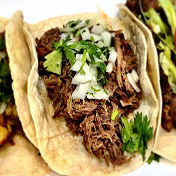

# El Gringo restaurant-css-framework
## Project : A new web site With Bootstrap

__Objetctive :__ Realizes the showcase site of a restaurant franchise. 

* The franchise is fictional but the type of food (burger, pizza, Asian, ...) is left to the choice of the learner.

* The site must be responsive: at least for small screens (xs) and medium screens (md)

* A minimum of 5 pages is needed, with a 'navbar' to access it. ( Home, Menu, Photos, Restaurants, Contact )

## Composition of the Site

1. Home : with a jumbotron and two pannels to present news, event, or promotions of the week ( for exemple )
2. Menu : with menus presented as a grouped list with badges.
3. Photos : a minimum of ten images ( three per pages ) with buttons to turn the page.
4. Restaurants : for each site, the address, the map to access, the hours of opening.
5. Contact : a page with a contact form, with firstname, lastname, email, subject ( dropdown list with choice ) and a send button.

I have make the choice a Mexican restaurant, here is the result of my work:

<details>
<summary>The HTML</summary>
    
<!DOCTYPE html>
<html lang="fr">

<head>
    <meta charset="UTF-8">
    <meta name="viewport" content="width=device-width, initial-scale=1.0">
    <meta http-equiv="X-UA-Compatible" content="ie=edge">
    <link href="assets/css/bootstrap/bootstrap.css" rel="stylesheet">
    <link rel="stylesheet" href="https://use.fontawesome.com/releases/v5.8.2/css/all.css"
        integrity="sha384-oS3vJWv+0UjzBfQzYUhtDYW+Pj2yciDJxpsK1OYPAYjqT085Qq/1cq5FLXAZQ7Ay" crossorigin="anonymous">
    <link rel="stylesheet" href="assets/css/style.css">
    
</head>

<body>
    <header>
        <nav class="navbar navbar-expand-lg navbar-dark bg-dark">
            <div class="container">
                <a class="navbar-brand">El Gringo</a>
                <button class="navbar-toggler" type="button" data-toggle="collapse"
                    data-target="#navbarSupportedContent" aria-controls="navbarSupportedContent" aria-expanded="false"
                    aria-label="Toggle navigation">
                    <span class="navbar-toggler-icon"></span>
                </button>

                <div class="collapse navbar-collapse" id="navbarSupportedContent">
                    <ul class="navbar-nav mr-auto">
                        <li class="nav-item ">
                            <a class="nav-link" href="index.html">Accueil <span class="sr-only">(current)</span></a>
                        </li>
                        <li class="nav-item">
                            <a class="nav-link" href="Carte.html">Carte</a>
                        </li>
                        <li class="nav-item">
                            <a class="nav-link active" href="Photos.html">Photos</a>
                        </li>
                        <li class="nav-item">
                            <a class="nav-link" href="Resto.html">Restaurants</a>
                        </li>
                        <li class="nav-item">
                            <a class="nav-link" href="Contact.html">Contact</a>
                        </li>
                    </ul>
                    <button class="btn btn-outline-primary my-2 my-sm-0 mr-5" type="submit"><i
                            class="fab fa-facebook-square mr-2"></i>Like

                    </button>
                    </form>
                </div>
            </div>
        </nav>

    </header>

    <main class="py-4">
        <section class="container">
            <div class="tof mt-5 ">
                <div class="tab-content" id="pills-tabContent">
                    <div class="tab-pane fade show active" id="pills-home" role="tabpanel"
                        aria-labelledby="pills-home-tab"></div>
                    <div class="tab-pane fade" id="pills-profile" role="tabpanel" aria-labelledby="pills-profile-tab">
                        </div>
                    <div class="tab-pane fade" id="pills-contact" role="tabpanel" aria-labelledby="pills-contact-tab">
                        </div>
                    <div class="tab-pane fade" id="pills-cont" role="tabpanel" aria-labelledby="pills-cont-tab"></div>
                </div>
            </div>
            <div class="chiffre">
                <ul class="nav nav-pills mt-4 justify-content-center" id="pills-tab mr-auto" role="tablist">
                    <li class="nav-item">
                        <a class="nav-link active" id="pills-home-tab" data-toggle="pill" href="#pills-home" role="tab"
                            aria-controls="pills-home" aria-selected="true">-1-</a>
                    </li>
                    <li class="nav-item">
                        <a class="nav-link" id="pills-profile-tab" data-toggle="pill" href="#pills-profile" role="tab"
                            aria-controls="pills-profile" aria-selected="false">-2-</a>
                    </li>
                    <li class="nav-item">
                        <a class="nav-link" id="pills-contact-tab" data-toggle="pill" href="#pills-contact" role="tab"
                            aria-controls="pills-contact" aria-selected="false">-3-</a>
                    </li>
                    <li class="nav-item">
                        <a class="nav-link" id="pills-cont-tab" data-toggle="pill" href="#pills-cont" role="tab"
                            aria-controls="pills-cont" aria-selected="false">-4-</a>
                    </li>
                </ul>
            </div>
        </section>
    </main>
    <script src="https://code.jquery.com/jquery-3.3.1.slim.min.js"></script>
    <script src="https://cdnjs.cloudflare.com/ajax/libs/popper.js/1.14.7/umd/popper.min.js"></script>
    <script src="https://stackpath.bootstrapcdn.com/bootstrap/4.3.1/js/bootstrap.min.js"></script>
</body>

</html>

```
</details>


For example the Photos page code :

[](https://goopics.net/i/Aq14A)

[](https://goopics.net/i/1oD7K)

[](https://goopics.net/i/mLd81)
